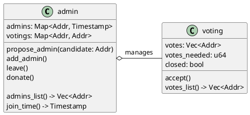
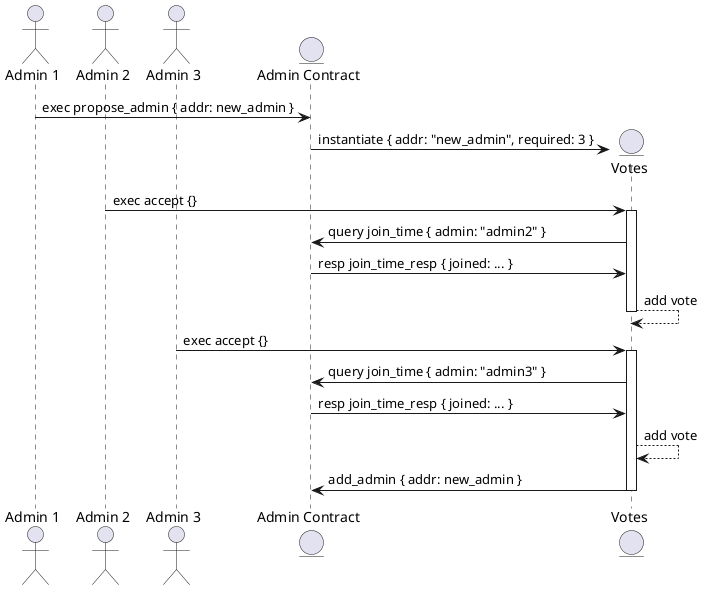
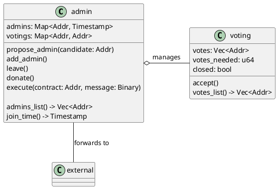
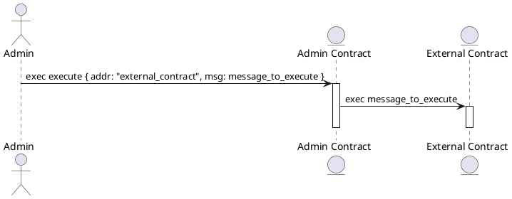

# 设计

这一次我们将讨论系统的设计。构建多合约系统往往比单独的合约复杂一些，所以我想给你一些关于本章构建内容的指引。如果你在设计上感到迷失，不用担心 - 在实施合约时一切都会变得清晰起来。现在，先浏览一遍以获得一个大致的了解。

首先，让我们思考一下我们要解决的问题。我们的管理员是一个地址向量。任何已经是管理员的人都可以将其他人添加到列表中。但是这个“其他人”可能是同一个管理员账户的第二个实例，这样他的捐赠计数就会算两次！

这个问题相对比较简单修复，但还有另一个问题 - 正如我们已经了解的，管理员可以创建一个只有他自己可以从中提取代币并注册为组中的另一个管理员的智能合约！通过多次实例化，即使我们阻止了多次添加相同地址，他仍然可以达到他的目标。同一个人可能拥有多个不同的地址。

这看起来是一个令人不愉快的情况，但有办法来管理它。我们将要实现的方法是投票。管理员不再能够直接将另一个管理员添加到列表中，而是可以提议他们的同事成为新的管理员。这将启动一个投票过程 - 在提议创建时已经是管理员的每个人都可以支持它。如果超过半数的管理员支持新的候选人，他将立即成为管理员。

这并不是最复杂的投票过程，但对于我们的目的已经足够了。

## 投票过程

为了实现这个目标，我们将创建两个智能合约。首先，我们将重用 [基础知识](../basics.md) 章节中的一个合约 - 它将是一个 `admin` 合约。另外，我们将添加一个 `voting` 合约。它将负责管理单个投票过程。每当管理员想要将他的朋友添加到列表中时，它将由 `admin` 合约实例化。下面是合约之间关系的示意图：

这里是添加管理员流程图 - 假设合同上已经有5个管理员，但其中2个什么也没做：

我已经提供了一些关于合同实施的提示，但我暂时不会深入讨论它们。

## 消息转发

我们还想添加一件事情 - 提供给管理员一种工作方式。`admin`合约将充当调用另一个合约的代理。这意味着其他外部合约将仅将我们的`admin`实例设置为可以对其执行操作的特定地址，管理员将通过这种方式执行操作。外部合约将以`admin`合约执行的方式执行操作。下面是更新后的合约图示：

调用外部合约流程图：

请注意，在`execute`管理员合约消息中的`msg`是一个随意转发给外部合约的消息。在现实世界中，它将是一个Base64编码的消息，但这只是一个实现细节。

最终，我们将创建一个简单的外部合约示例，以了解如何使用这种模式。